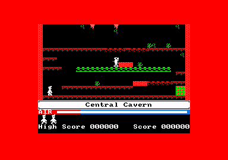
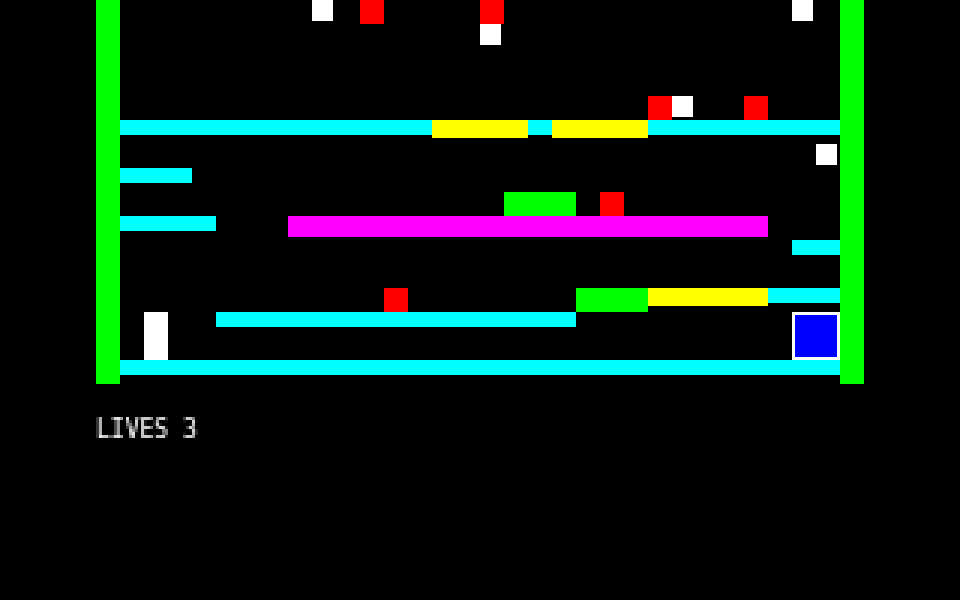

# Manic Miner

> Work in progress.

A web recreation of the Amstrad CPC version of *Manic Miner*. The project is
currently in an early stage, with development focused on building the core game
mechanics incrementally before creating the levels and polishing the visuals.

## Visual comparison

<table>
  <thead>
    <tr>
      <th>Amstrad CPC reference</th>
      <th>Current gameplay graybox</th>
    </tr>
  </thead>
  <tbody>
    <tr>
      <td>
        
      </td>
      <td>
        
      </td>
    </tr>
  </tbody>
</table>

Original Amstrad CPC screenshot
[via MobyGames](https://www.mobygames.com/game/6440/manic-miner/screenshots/cpc/441969/).
It is included as external reference material and is not used as a game asset.

## Project documentation

* [Development roadmap](./ROADMAP.md)
* [Technical specifications](./manic-miner-specs.md)

## Temporary shortcuts

* Press `1` to restart the game from its initial state.
