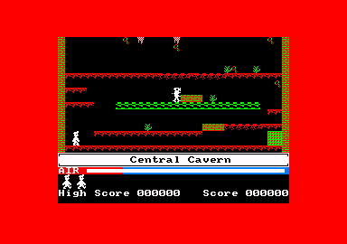
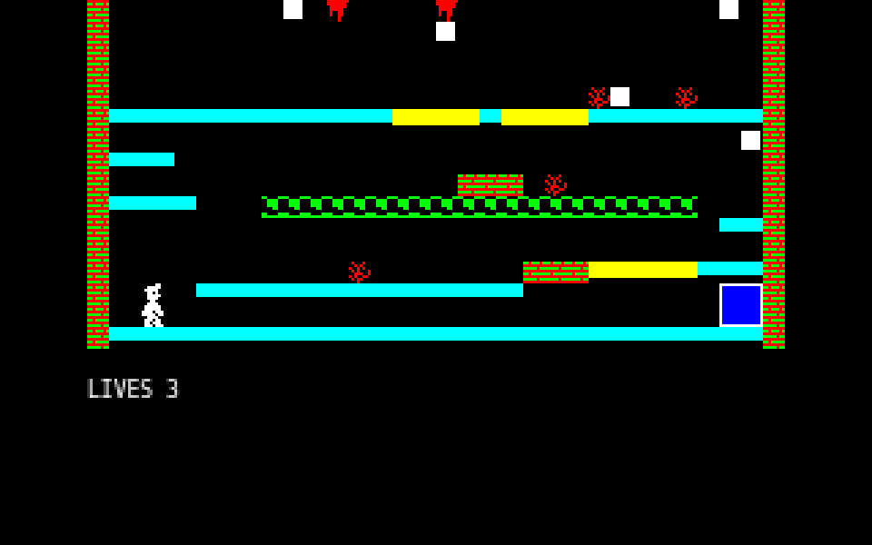

# Manic Miner

> Work in progress.

A web recreation of the Amstrad CPC version of *Manic Miner*. The project is
currently in an early stage, with development focused on building the core game
mechanics incrementally before creating the levels and polishing the visuals.

## Play online

[Play the current prototype on Vercel](https://manic-ts.vercel.app/).

## How to play

Collect every white item in the cavern to unlock the exit, then enter the exit
to complete the level. Avoid the red hazards: touching one costs a life and
restarts the cavern. Collapsible platforms disappear as Willy walks over them,
and conveyors carry him in their indicated direction.

| Action | Controls |
| --- | --- |
| Move left | `Left Arrow` or `A` |
| Move right | `Right Arrow` or `D` |
| Jump | `Space` or `Up Arrow` |
| Restart the game | `1` |

Willy cannot change direction during a jump. Walking off a ledge also produces
a vertical fall, so line up each jump before leaving the platform.

## Visual comparison

<table>
  <thead>
    <tr>
      <th>Amstrad CPC reference</th>
      <th>Current gameplay graybox</th>
    </tr>
  </thead>
  <tbody>
    <tr>
      <td>
        
      </td>
      <td>
        
      </td>
    </tr>
  </tbody>
</table>

Original Amstrad CPC screenshot
[via MobyGames](https://www.mobygames.com/game/6440/manic-miner/screenshots/cpc/441969/).
It is included as external reference material and is not used as a game asset.

## Project documentation

* [Development roadmap](./ROADMAP.md)
* [Deployment workflow](./docs/deployment.md)
* [Technical specifications](./manic-miner-specs.md)
